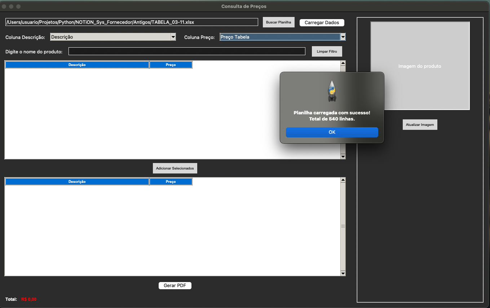
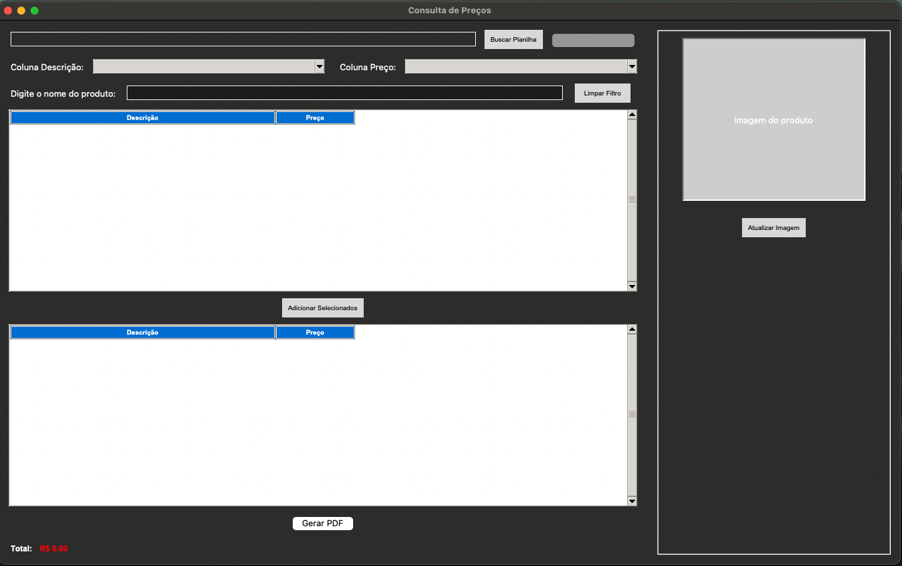
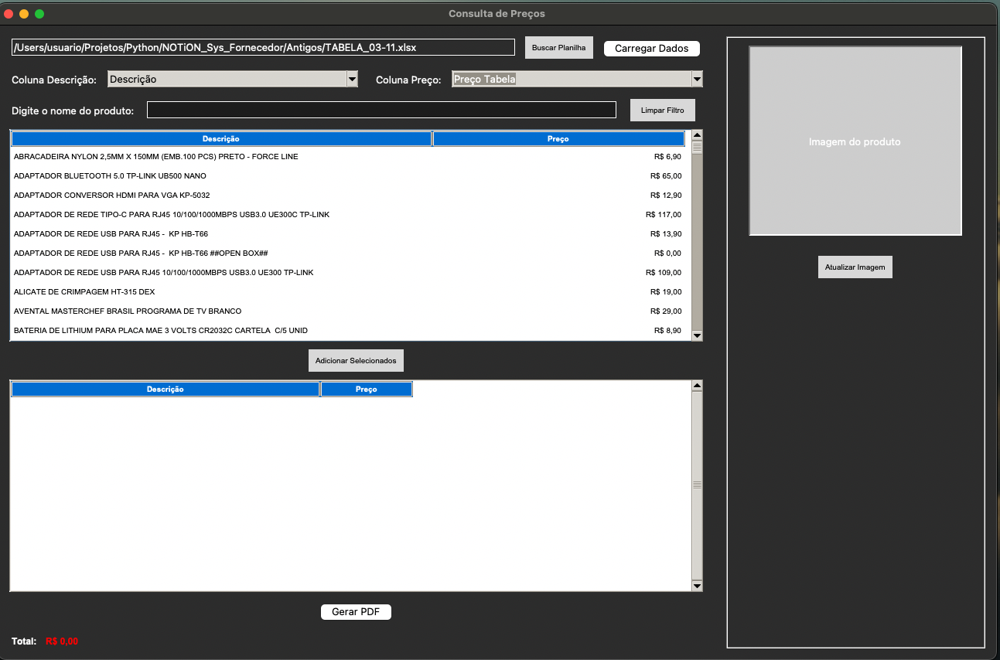
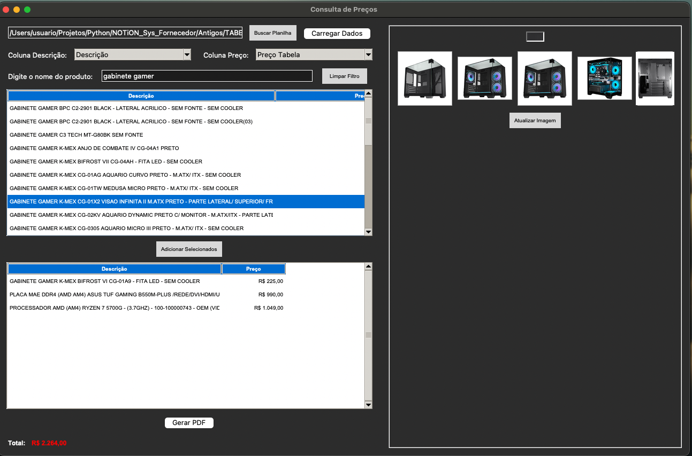
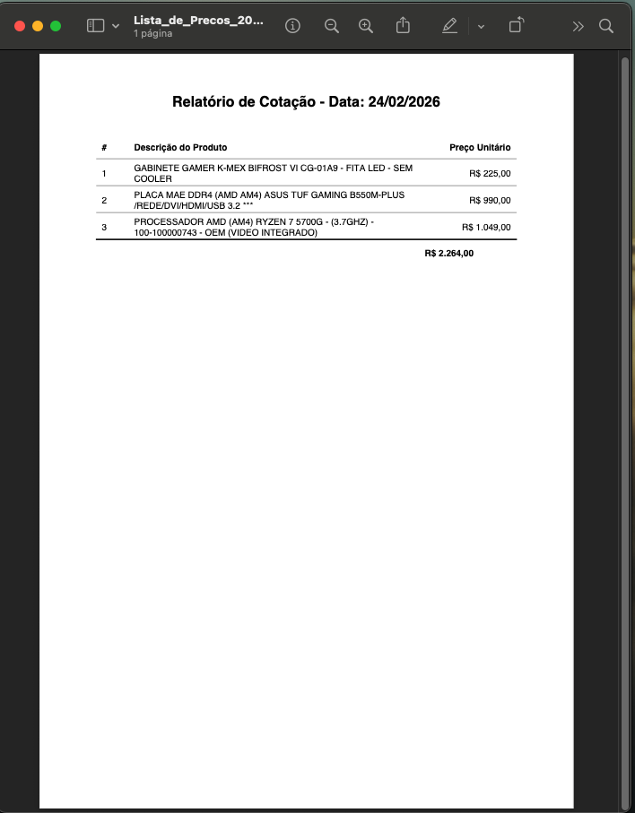

# Desktop App: Consulta e Precificação de Fornecedores 📊

Um aplicativo Desktop (GUI) desenvolvido em Python que automatiza o processo de consulta de preços a partir de planilhas de fornecedores. O sistema lê dados brutos (Excel/CSV), permite a busca de itens, consome a API do Google Custom Search para trazer imagens dos produtos em tempo real (cache inteligente), e gera um relatório final precificado em PDF para o cliente.

## 🎯 Por que este projeto existe?
Foi criado para resolver um problema real de retaguarda e suporte a vendas. Anteriormente, era necessário abrir planilhas pesadas, buscar produto a produto no Google para ver a "cara" do item, e depois montar o orçamento à mão. Este sistema unifica o banco de dados (planilha), a visualização (API) e a saída de dados (Relatório em PDF).

## 💡 Habilidades Aplicadas

- **Engenharia de Software (Python):** Arquitetura modular separando Interface (Tkinter), Banco de Dados (Pandas), Integração de API (Requests) e Geração de Relatórios (ReportLab).
- **Consumo de APIs e Redes:** Implementação de chamadas REST para a API do Google Custom Search, tratamento de JSON e download concorrente de binários (imagens) usando *Multithreading* para não travar a UI principal.
- **Manipulação de Dados (ETL):** Uso de `pandas` para leitura, sanitização (remoção de NaNs, formatação de tipos) e conversão de DataFrames em objetos de UI.
- **Desktop GUI & UX:** Uso do `tkinter` e `ttk` para criar uma experiência responsiva e com feedback visual (cursores de carregamento, treeviews dinâmicas, cache de imagens).

## 🛠️ Tecnologias Principais
* **Linguagem:** Python 3
* **Interface:** Tkinter (nativo) e Pillow (processamento de imagens)
* **Manipulação de Dados:** Pandas e Openpyxl
* **Redes / API:** Requests, python-dotenv
* **Exportação de Dados:** ReportLab (Geração de PDF)

---

## 📁 Estrutura do Projeto
A arquitetura foi pensada para ser limpa e separar as responsabilidades:

```text
📦 Sys_Fornecedor
 ┣ 📂 screenshots/          # Evidências do projeto rodando
 ┣ 📂 src/                  # Código Fonte
 ┃ ┣ 📜 main.py             # Entrypoint da Aplicação e Janela Principal Tkinter
 ┃ ┣ 📜 database.py         # Camada de manipulação de dados Pandas/Openpyxl
 ┃ ┣ 📜 imagem.py           # Integração com Google API e Cache multithread
 ┃ ┗ 📜 pdf_generator.py    # Lógica estrutural do ReportLab A4
 ┣ 📜 .env.example          # Exemplo das credenciais exigidas de API
 ┣ 📜 requirements.txt      # Dependências lockadas
 ┗ 📜 README.md             # Esta documentação
```

---

## 🚀 Como Rodar o Projeto Localmente

### 1. Preparando o Ambiente
Recomenda-se o uso de um ambiente virtual (`venv`):
```bash
python -m venv venv
source venv/bin/activate  # No Windows: venv\\Scripts\\activate
```

### 2. Instalação das Dependências
```bash
pip install -r requirements.txt
```

### 3. Configuração da API do Google (Busca de Imagens)
Para que a busca visual dos produtos funcione, o sistema requer credenciais do **Google Custom Search API**.
1. Renomeie o arquivo `.env.example` para `.env`
2. Insira suas chaves no arquivo:
```env
GOOGLE_API_KEY=sua_api_key_aqui
GOOGLE_CX=seu_cx_aqui
```

### 4. Executando o Sistema
Basta rodar o arquivo principal. A interface gráfica será iniciada automaticamente.
```bash
python src/main.py
```

## 📸 Telas do Sistema em Ação

Para ilustrar o uso detalhado da nossa solução de orçamentos, aqui está o funcionamento do painel:

**1. Carregamento da Planilha Raiz (Home):**
> Janela inicial pronta para receber os dados do fornecedor `.xlsx` ou `.csv`


**2. Sistema Principal Visualizando os Itens e Buscando API:**
> Seleção e exibição inteligente de metadados consumindo `Google Custom Search API`


**3. Pesquisa Expandida (Imagens Secundárias):**
> O usuário clica, e as multi-threads baixam o cache de imagens para a galeria


**4. Montagem da Lista (Carrinho):**
> Transição dos itens pesquisados e mapeados para o fechamento do orçamento


**5. Relatório e PDF Gerado Para o Cliente:**
> View final onde o módulo ReportLab escreve e consolida nossos PDFs Orçamentais


## 📌 Fluxo de Uso
1. **Carregar:** Selecione uma planilha (Ex: lista de peças de hardware).
2. **Mapear Colunas:** O sistema agrupa automaticamente, mas você pode escolher qual coluna é a *Descrição* e qual é o *Preço*.
3. **Buscar:** Digite no filtro para achar as peças.
4. **Visualizar Pelo Cache (1 Clique):** Clique uma vez em um item para o sistema baixar as miniaturas da peça e renderizar dentro do painel.
5. **Busca Externa (Clique Duplo):** Faltou imagem no painel ou quer ver em tela cheia? Dê um *duplo-clique* rápido na linha do produto na lista. O sistema abrirá automaticamente o seu navegador principal pesquisando o produto no Google Imagens! 
6. **Orçar:** Clique em "Adicionar Selecionados" para ir montando o carrinho final.
7. **Exportar:** Ao clicar em "Gerar PDF", o sistema compila o relatório, salva e abre o arquivo pronto para envio ao cliente.
